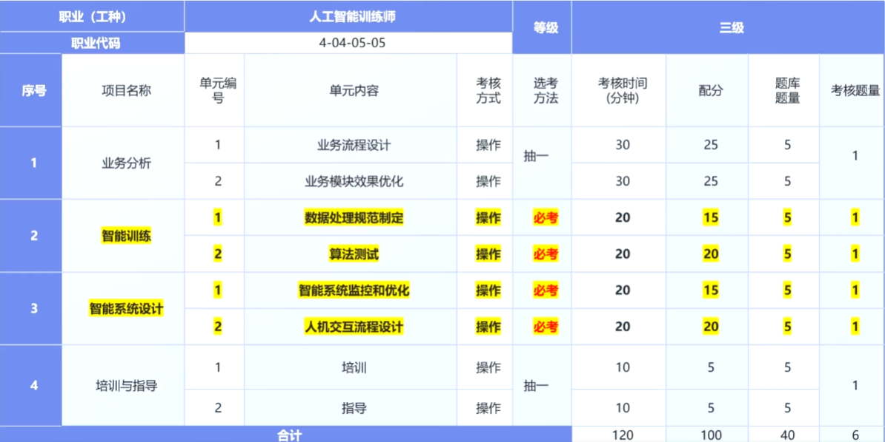

# 人工智能训练师

# 人工智能训练师：三级
## 考试方式
- 人工智能训练师（三级）的认定方式分为理论知识考试和操作技能考核；
- 理论知识考试采用闭卷机考方式，操作技能考核采用计算机机考方式；
- 理论知识考试和操作技能考核均实行百分制，成绩都要60分以上者为合格；
- 理论知识或操作技能不及格者可按规定分别补考。

|题型|考试方式|认定题量|分值（分/题）|配分|
|-|-|-|-|-|
|判断题|闭卷机考|40|0.5|20|
|单选题|闭卷机考|140|0.5|70|
|多选题|闭卷机考|10|1|10|
|小计|-|190|-|100|

- 考试时间九十分钟；
- 公开70%题目（微信刷题小程序：考试宝）

## 素材讲解
- 请在以下文件夹中寻找到考试素材相关资料
  - .\docs\三级\三级素材
  - .\docs\三级\三级素材及对应答案

|题目范围|考察内容|解答思路|
|-|-|-|
|1.1.1 - 1.1.5|数据清洗与初步统计|使用Python基础库（如pandas、numpy）读取表格数据，处理异常值并进行数理统计。|
|3.1.1 - 3.1.5||使用Excel中的数据透视表、排序、求平均值等基础操作即可解答。|