# 环境配置及题库下载
## 环境配置
### Anaconda安装
|下载方式|网址|
|-|-|
|Anaconda3 官方网站|https://www.anaconda.com/download|
|清华大学开源软件镜像站|https://mirrors.tuna.tsinghua.edu.cn/anaconda/archive/|

- 下载名为【Anaconda3-x.x.x-Windows-x86_64.exe】的最新版安装包
- 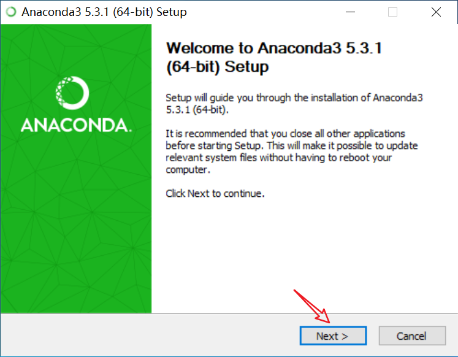
- 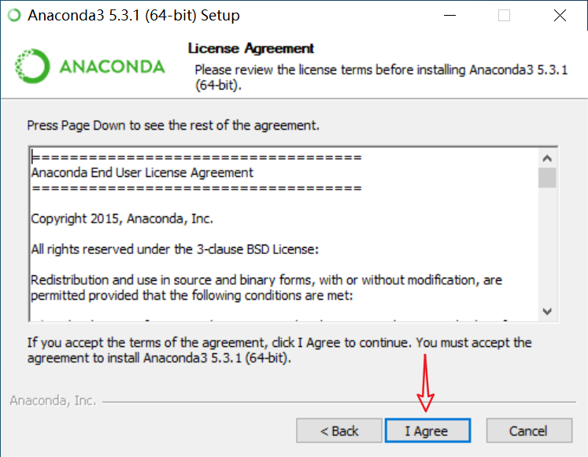
- 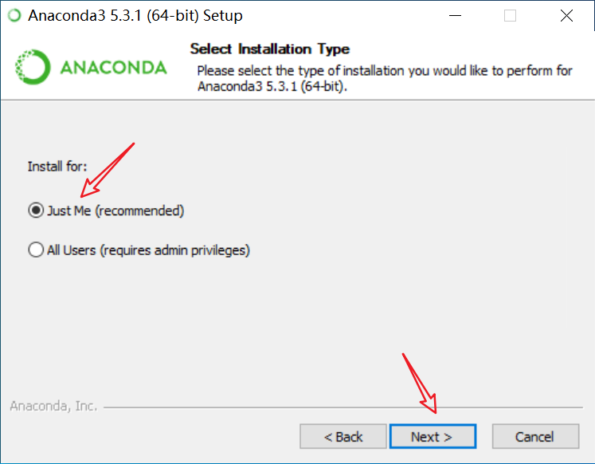
- 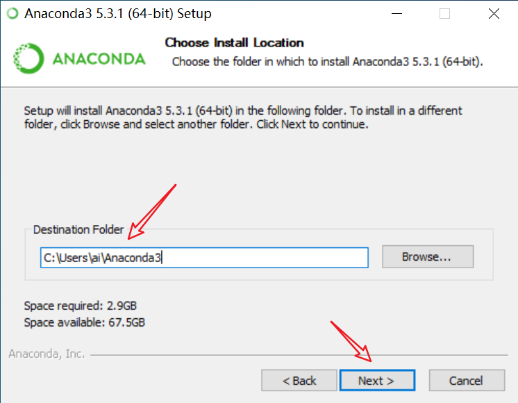
- 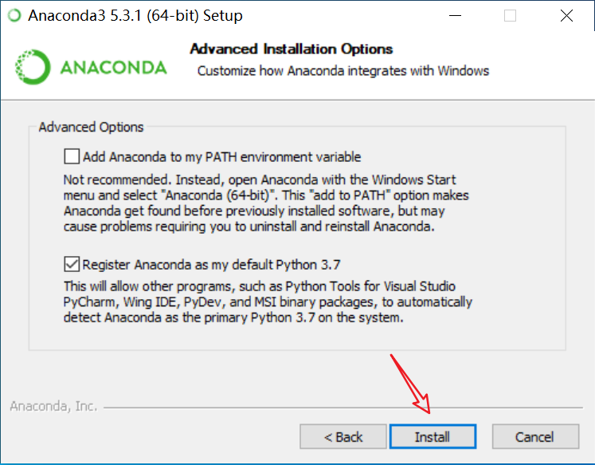
- 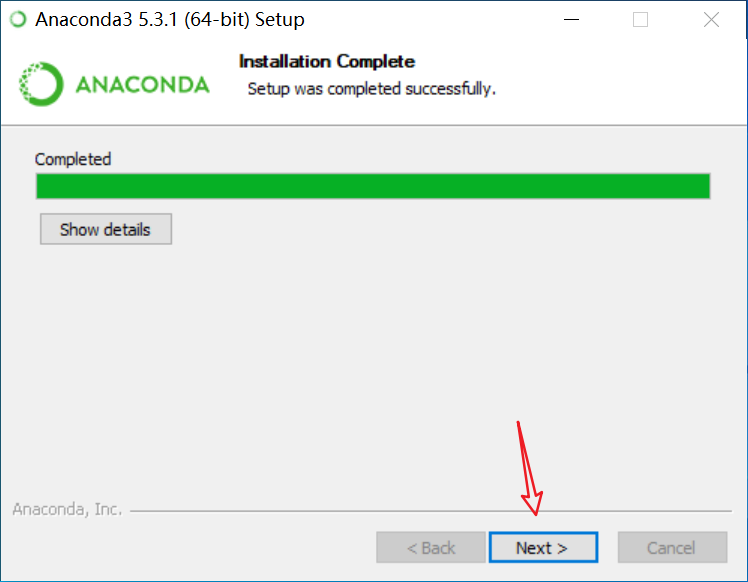
- 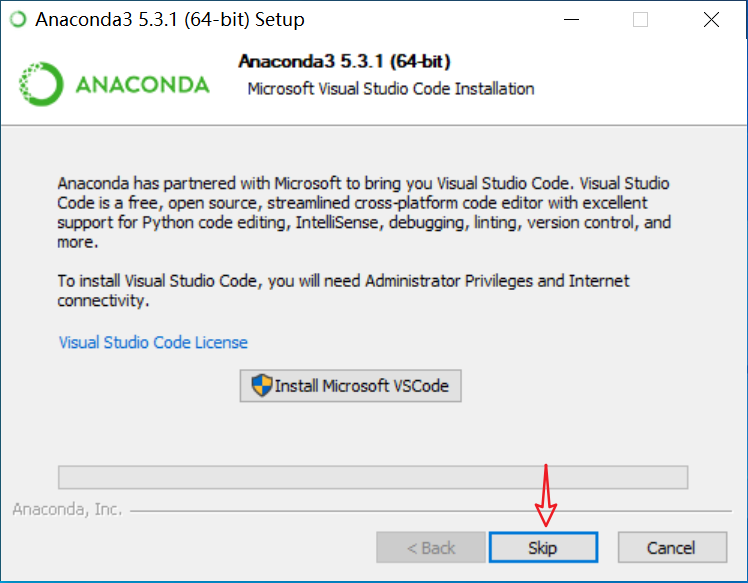
- 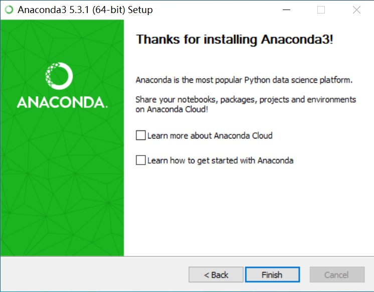
- 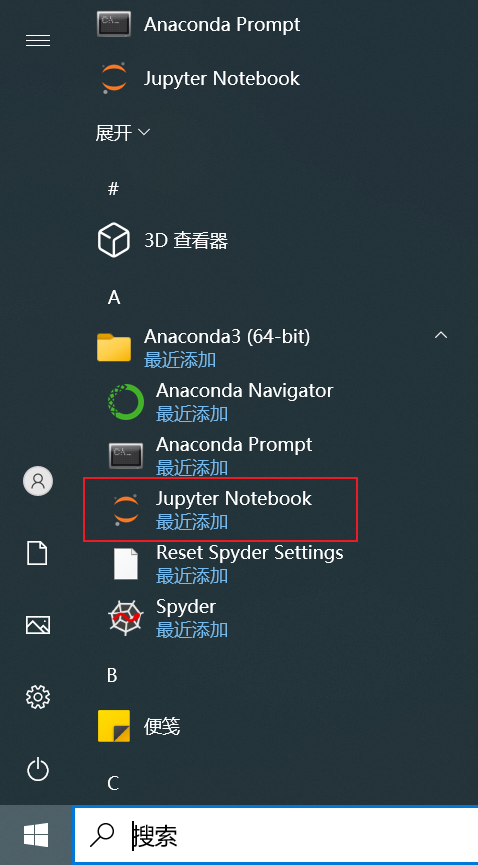
- 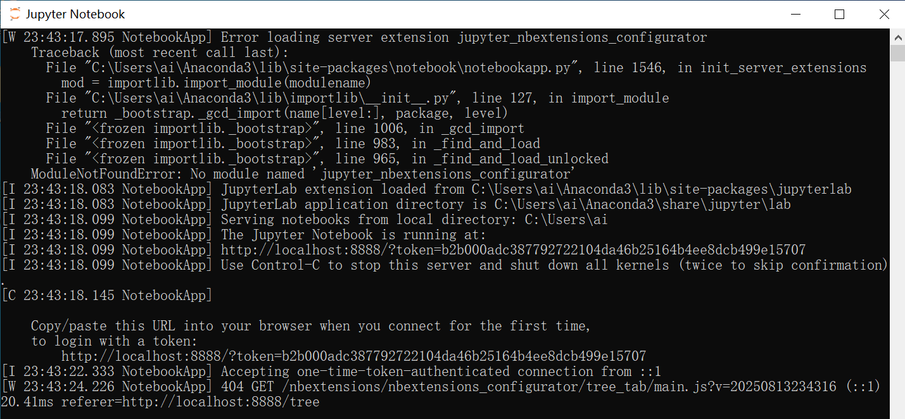
- 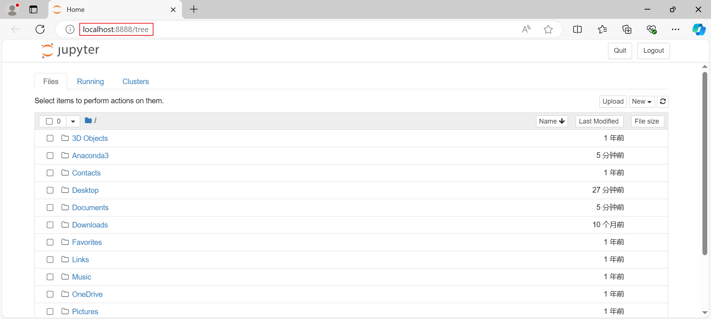
- 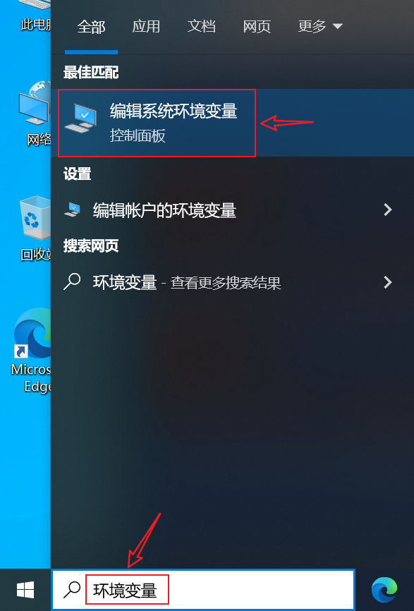
- 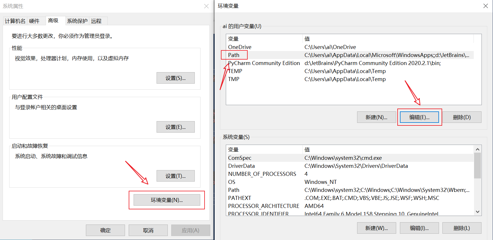
- 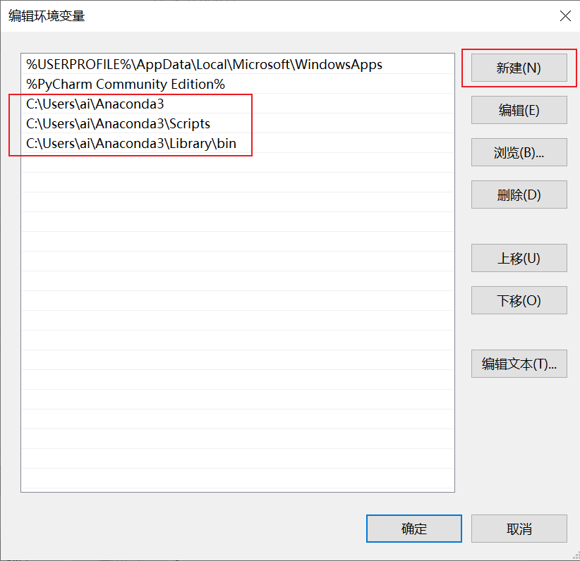
- 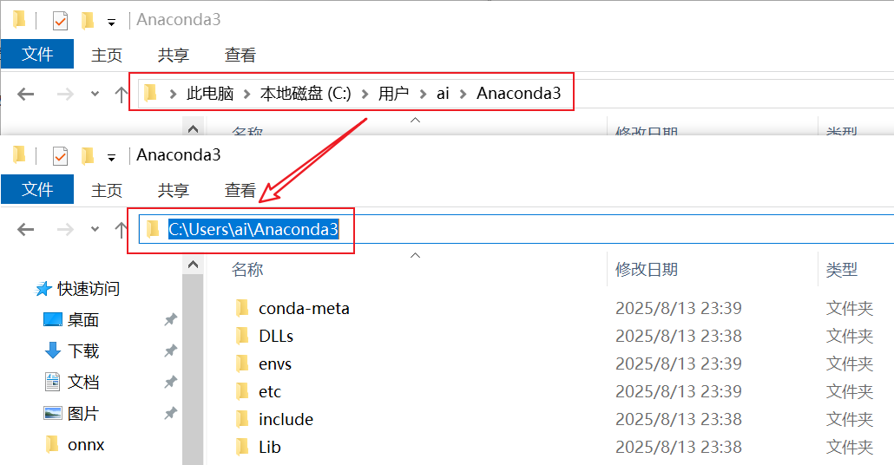
- 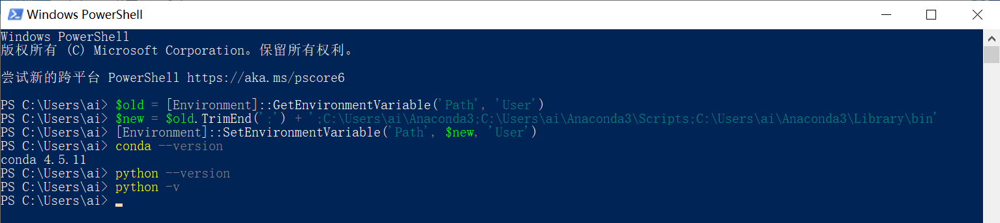

### 在制定路径下启动Jupyter Notebook
- 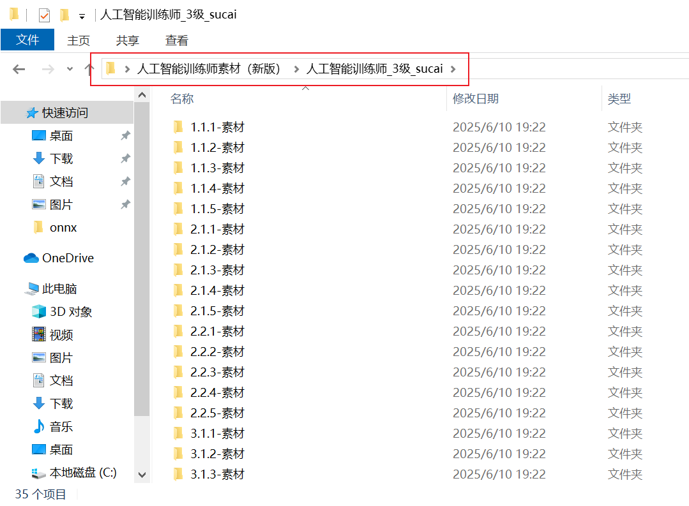
- 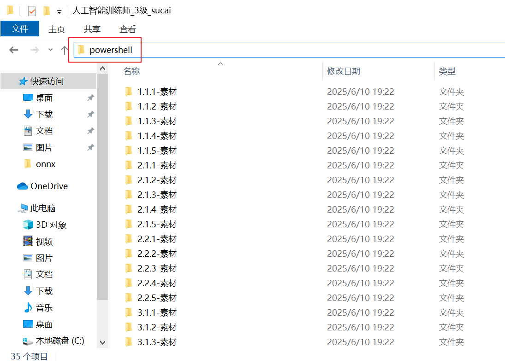
- 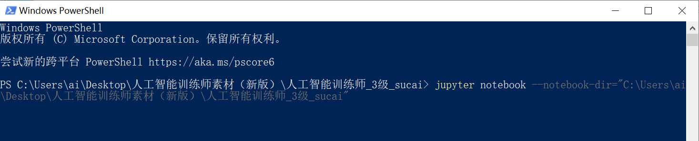
- 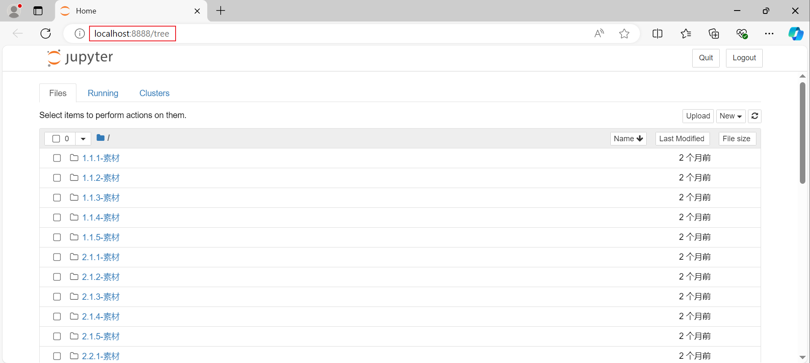
### 题库下载
|下载方式|路径|
|-|-|
|上海交通大学官网|https://gjzs.sjtu.edu.cn/skill|
|百度网盘|https://pan.baidu.com/s/1tMvrP5U8YU9GLUDeMGBmkQ?pwd=y7kv|
|迅雷或其他BT下载工具||